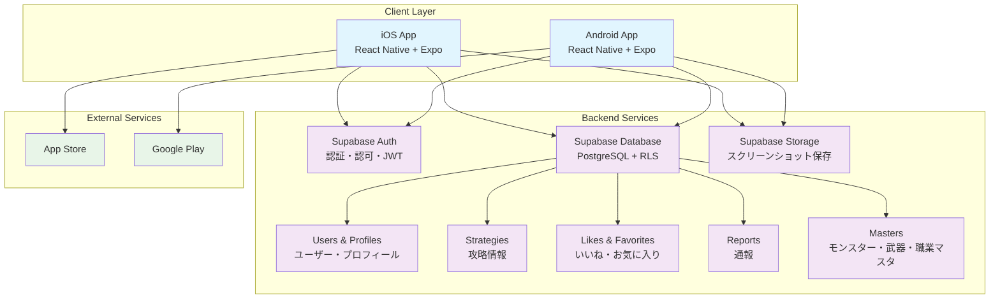
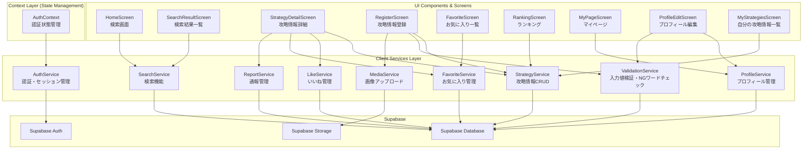

# アーキテクチャ設計書

## 技術仕様

### フロントエンド
- React Native
- Expo

### バックエンド・データベース
- Supabase

### プラットフォーム
- iOS/Android対応のスマートフォンアプリ

## 技術スタック
- **フロントエンド**: React Native + Expo
- **データベース**: Supabase PostgreSQL + RLS
- **認証**: Supabase Auth (JWT) - メールアドレス/パスワード、X（旧Twitter）認証
- **ストレージ**: Supabase Storage（スクリーンショット画像保存）
- **ナビゲーション**: 5タブナビゲーション（ホーム/お気に入り/登録/ランキング/マイページ）
- **状態管理**: React Context（AuthContext）

## システム構成図



## データベース構成

### Supabaseプロジェクト共用
本アプリはdqwfuntool内でSupabaseプロジェクトを共用する。以下のテーブルは他アプリと共通で使用する。

| 共用テーブル | 説明 |
|-------------|------|
| users | ユーザー認証情報（auth.users） |
| profiles | プロフィール情報（ニックネーム、アイコン、Xアカウント名） |

これにより、同一アカウントで複数アプリへのシングルサインオンが可能となる。

### テーブル構成
| テーブル名 | 説明 | RLSポリシー | 備考 |
|-----------|------|-------------|------|
| users | ユーザー情報 | 自分のデータのみ更新可、参照は全員可 | 共用 |
| profiles | プロフィール情報（ニックネーム、アイコン、Xアカウント名） | 自分のデータのみ更新可、参照は全員可 | 共用 |
| monsters | モンスターマスタ | 参照のみ（管理アプリから更新） | 本アプリ専用 |
| weapons | 武器マスタ | 参照のみ（管理アプリから更新） | 本アプリ専用 |
| jobs | 職業マスタ | 参照のみ（管理アプリから更新） | 本アプリ専用 |
| strategies | 攻略情報 | 自分のデータのみCRUD可、参照は全員可 | 本アプリ専用 |
| strategy_members | パーティメンバー情報（4人分） | strategiesに従属 | 本アプリ専用 |
| likes | いいね | 自分のいいねのみCRUD可 | 本アプリ専用 |
| favorites_strategies | 攻略情報お気に入り | 自分のお気に入りのみCRUD可 | 本アプリ専用 |
| favorites_searches | 検索条件お気に入り | 自分のお気に入りのみCRUD可 | 本アプリ専用 |
| reports | 通報 | 自分の通報のみ参照・登録可、更新・削除不可 | 本アプリ専用 |
| ng_words | NGワードリスト | 参照のみ（管理アプリから更新） | 共用 |

## フロントエンドアーキテクチャ

### サービス層アーキテクチャ


### 主要サービス詳細

#### AuthService（認証管理）
- **メールアドレス/パスワード認証**: Supabase Authによるサインアップ・ログイン
- **X（旧Twitter）認証**: OAuth連携
- **セッション管理**: オートログイン、ログアウト
- **認証状態確認**: isAuthenticated(), getCurrentUser()

#### StrategyService（攻略情報管理）
- **CRUD操作**: 攻略情報の登録・取得・更新・削除
- **パーティ構成管理**: 4人分のメンバー情報管理
- **画像関連**: スクリーンショットURL管理

#### SearchService（検索機能）
- **検索機能**: モンスター・武器による検索
- **ソート機能**: いいね数順ソート
- **ページネーション**: 効率的なデータ取得

#### ValidationService（入力値検証）
- **NGワードチェック**: 登録時にNGワードリストと照合
- **入力値検証**: 必須項目チェック、文字数制限

## セキュリティアーキテクチャ

### データアクセス制御
**方針**: クライアントからSupabaseへ直接アクセス。RLSによるデータ保護。

```
[アプリ] → [Supabase Database (RLS)]
            ↑
          anon key + JWT
```

### RLS（Row Level Security）設計

| 操作 | ポリシー |
|------|----------|
| SELECT（参照） | 全員許可（公開データ） |
| INSERT（登録） | 認証済みユーザーのみ |
| UPDATE（更新） | 自分のデータのみ |
| DELETE（削除） | 自分のデータのみ |

### リスク認識（データスクレイピング）
- RLSで参照を全員許可としているため、悪意のある第三者がSupabaseのURLとanon keyを取得し、APIを直接呼び出してデータを一括取得するリスクがある。
- 対象データ: 攻略情報、ニックネーム、Xアカウント名、アイコン画像URL等
- 許容理由:
  - 元々公開・共有目的のデータであり機密性は低い
  - 個人情報を保持しない設計
  - 個人開発・小規模運用のファンツール
- 将来的にRate Limiting（API呼び出し制限）やページネーション強制の導入を検討可能

### NGワードチェック
- **チェックタイミング**: クライアント側で登録時にチェック
- **対象項目**: 「行動順序・内容入力」「ニックネーム」
- **NGワードリスト**: Supabaseに保存、管理アプリでメンテナンス

## 選択理由

- **React Native + Expo**: 個人開発に最適。一つのコードベースでiOS/Android対応、豊富なライブラリとExpoの簡単なビルド・デプロイ機能
- **Supabase**: Firebase代替のオープンソースBaaS。PostgreSQL、認証、ストレージを統合提供。個人開発者に優しい料金体系
- **Supabase PostgreSQL**: 高機能なリレーショナルDB。Row Level Security（RLS）でセキュアなマルチテナント設計が可能
- **Supabase Auth**: JWT認証、OAuth対応（X認証）、メール認証など必要な認証機能を簡単に実装。追加コストなし
- **Supabase Storage**: ファイル保存・配信。スクリーンショット画像の保存に使用

## 初期コスト（Initial）
- **Apple Developer Program**: $99/年
- **Google Play Developer**: $25（一回のみ）
- **合計初年度**: $124

## ランニングコスト

### Phase 1 (MVP - ~100ユーザー)
- **Supabase Free**: $0/月
- **合計**: $0/月

**Supabase Free枠:**
- Database: 500MB
- Storage: 1GB
- Auth: 50,000 MAU
- 十分な範囲で運用可能

### Phase 2 (成長期 - ~1,000ユーザー)
- **Supabase Pro**: $25/月
- **合計**: $25/月 ($300/年)

**Supabase Pro枠:**
- Database: 8GB
- Storage: 100GB
- 1,000ユーザー規模には十分

## アーキテクチャの特徴

### 個人開発最適化
- **シンプル構成**: Supabaseで認証・DB・ストレージを統合管理
- **ノーコード管理**: Supabaseダッシュボードで管理
- **簡単デプロイ**: Expo EAS Buildで自動ビルド・ストア申請

### コスト効率
- **無料枠活用**: MVP段階では$0で運用可能
- **段階的スケール**: ユーザー数に応じてプラン変更

### セキュリティ
- **RLS（Row Level Security）**: データベースレベルでのアクセス制御
- **JWT認証**: ステートレスで安全な認証システム
- **HTTPS**: 全通信の暗号化

### スケーラビリティ
- **1,000ユーザー対応**: 目標規模に十分対応可能
- **マネージドサービス**: インフラ管理の負担を最小化

## リスク軽減策

### 技術的リスク
- **Vendor Lock-in対策**: Supabaseはオープンソースのため、必要時に自前環境への移行が可能
- **障害対応**: Supabaseのマネージドサービスによる冗長化

### 運用リスク
- **法的対応**: ドラクエウォーク利用規約の遵守（ファンツールとして運用）
- **コスト管理**: 無料枠の活用と定期的な利用量監視
- **不正コンテンツ対策**: NGワードチェック + 通報機能 + 管理者対応

この設計により、個人開発でも安全で拡張性のある攻略情報共有アプリを低コストで構築・運用することが可能です。
