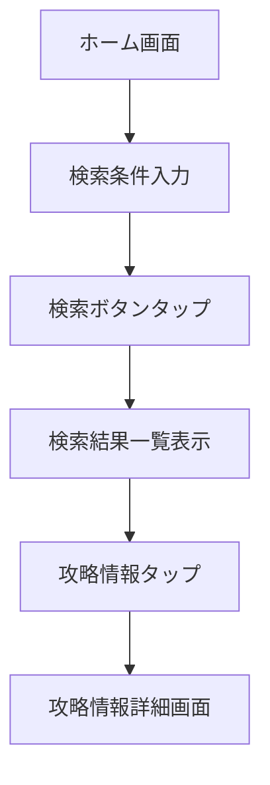
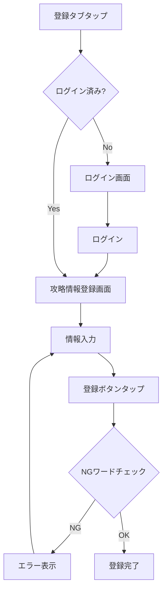
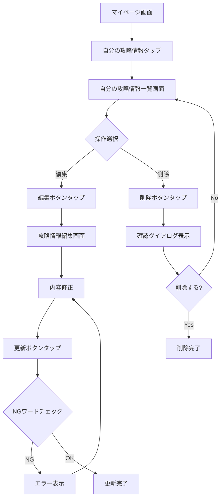
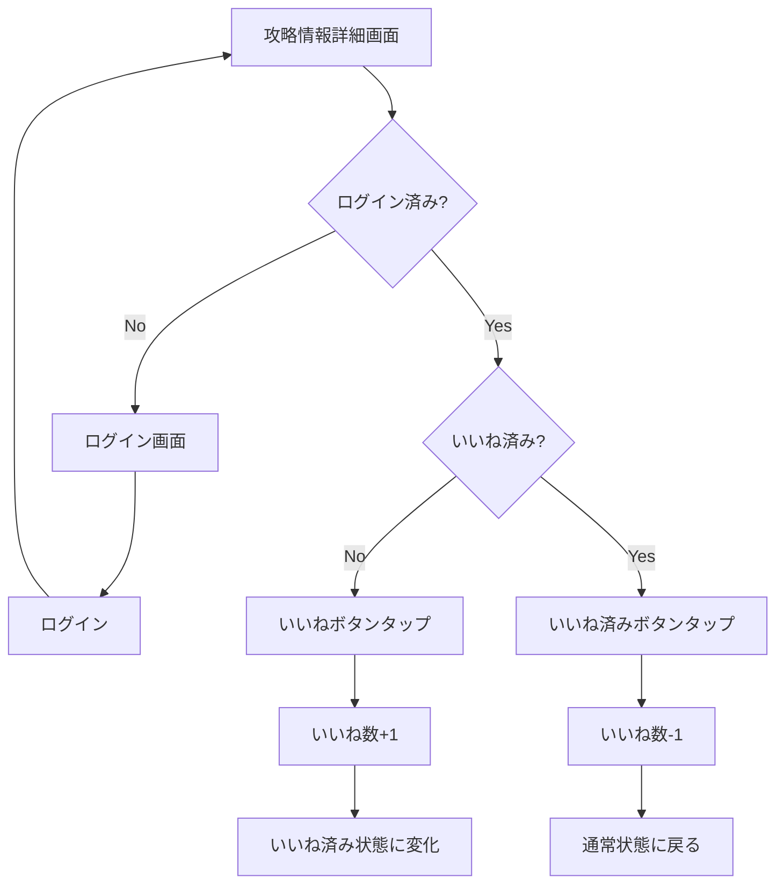
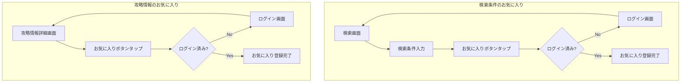
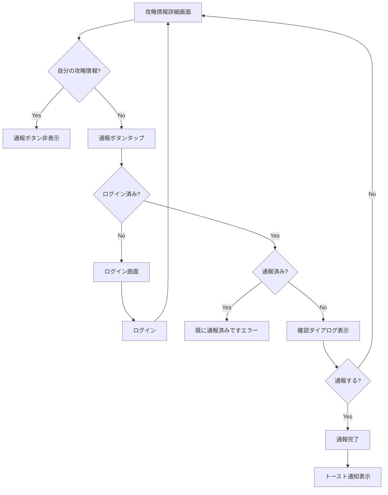
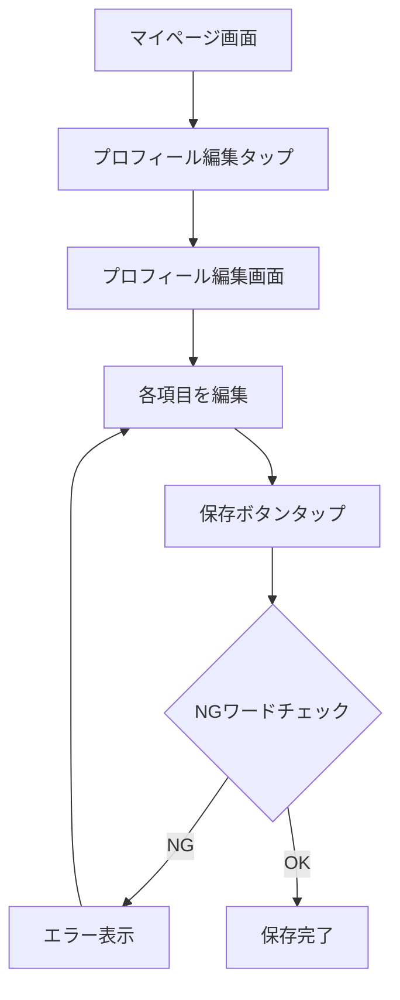

# 機能設計書

## 機能一覧

| 機能ID | 機能名 | 概要 |
|--------|--------|------|
| F001 | ユーザー認証 | メール/パスワード認証、X認証、オートログイン |
| F002 | 攻略情報検索 | モンスター・武器による検索、いいね数順ソート |
| F003 | 攻略情報詳細表示 | パーティ構成、行動順序、スクリーンショット表示 |
| F004 | 攻略情報登録 | モンスター攻略編成の登録 |
| F005 | 攻略情報編集・削除 | 自分の攻略情報の編集・削除 |
| F006 | いいね機能 | 攻略情報へのいいね付与・取り消し |
| F007 | お気に入り機能 | 検索条件・攻略情報のお気に入り登録 |
| F008 | 通報機能 | 不正・不適切な攻略情報の通報 |
| F009 | ランキング表示 | いいね数ランキング、登録者ランキング |
| F010 | プロフィール管理 | ニックネーム、アイコン、Xアカウント名の編集 |

### 非機能要件

| 要件ID | 要件名 | 基準値 | 備考 |
|--------|--------|--------|------|
| NFR001 | アプリ起動時間 | 3秒以内 | パフォーマンス |
| NFR002 | 検索結果表示 | 2秒以内 | パフォーマンス |
| NFR003 | 同時アクティブユーザー | 1,000人 | スケーラビリティ |
| NFR004 | データ暗号化 | HTTPS/TLS、bcrypt | セキュリティ |
| NFR005 | データバックアップ | 日次自動バックアップ | 運営・保守 |
| NFR006 | サポート体制 | ベストエフォート | 運営・保守 |

---

## ユーザー認証機能【F001】

ユーザーの新規登録とログイン認証を管理する機能。

### 機能概要
- メールアドレスとパスワードによるユーザー登録・ログイン
- X（旧Twitter）によるOAuth認証
- 前回ログイン情報の記憶によるオートログイン
- ログイン不要で攻略情報の閲覧が可能

### ログイン要否

| 機能 | ログイン |
|------|----------|
| 攻略情報の検索・閲覧 | 不要 |
| 攻略情報の登録・編集・削除 | 必要 |
| いいね | 必要 |
| お気に入り登録 | 必要 |
| 通報 | 必要 |

※未ログイン状態でログイン必須機能を実行 → ログイン画面に遷移

### 初回起動時の画面遷移
```
スプラッシュ画面 → ホーム画面（未ログイン状態）
                        ↓
              ログイン必須機能を実行
                        ↓
                ログイン画面へ遷移
```

### 登録フロー（メールアドレス/パスワード）
1. ログイン画面で「新規登録」をタップ
2. メールアドレス入力
3. パスワード入力（6文字以上）
4. パスワード確認入力
5. 「登録」ボタンをタップ
6. 確認メールが送信される
7. メール内のリンクをクリックして認証完了
8. アプリに戻ってログイン

### 登録フロー（X認証）
1. ログイン画面で「Xでログイン」をタップ
2. Xの認証画面に遷移
3. アプリへのアクセスを許可
4. アプリに戻ってログイン完了

### ログインフロー
1. ログイン画面表示
2. メールアドレス/パスワード入力、または「Xでログイン」
3. 「ログイン」ボタンをタップ
4. ホーム画面へ遷移

### 制約事項
- パスワードは6文字以上必須
- メールアドレスは有効な形式である必要がある
- 同じメールアドレスで重複登録不可

### エラーケース
- メールアドレス形式が不正: 「有効なメールアドレスを入力してください」
- パスワードが短い: 「パスワードは6文字以上で入力してください」
- メールアドレスが既に登録済み: 「このメールアドレスは既に登録されています」
- ログイン失敗: 「メールアドレスまたはパスワードが正しくありません」
- ネットワークエラー: 「通信エラーが発生しました。しばらくしてから再度お試しください」

---

## 攻略情報検索機能【F002】

モンスターや武器をキーに攻略情報を検索する機能。

### 機能概要
- 「攻略対象モンスター」「武器」で検索
- 検索結果をいいね数順にソート表示
- 検索条件のお気に入り登録が可能

### 利用シーン
- 特定のモンスターの攻略方法を知りたい
- 自分が持っている武器で倒せるモンスターを探したい

### 検索フロー
1. ホーム画面（検索画面）を表示
2. モンスターを選択（任意）
3. 武器を選択（任意）
4. 「検索」ボタンをタップ
5. 検索結果一覧画面に遷移
6. いいね数順でソート表示

### 検索条件
| 項目 | 入力方式 | 必須 |
|------|----------|------|
| モンスター | プルダウン選択 | 任意 |
| 武器 | プルダウン選択 | 任意 |

### 検索結果一覧表示項目
- モンスター名
- 攻略タイプ（ワンパン/セミオート/オート）
- いいね数
- 登録者ニックネーム

### 制約事項
- 検索条件が未入力の場合、全件表示（いいね数順）
- 一度に表示する件数: 20件（ページネーション）

### 操作フロー図


---

## 攻略情報詳細表示機能【F003】

攻略情報の詳細を表示する機能。

### 機能概要
- パーティ構成（4人分）の表示
- 各メンバーの武器・職業・装備スクリーンショット表示
- 行動順序・内容の表示
- 攻略タイプの表示
- いいね・お気に入り・通報ボタン

### 表示項目

| 項目 | 説明 |
|------|------|
| 攻略対象モンスター | モンスター名 |
| 攻略タイプ | ワンパン/セミオート/オート |
| パーティ構成（4人分） | 武器、職業、装備スクリーンショット（2枚/人） |
| 行動順序・内容 | フリーテキスト |
| いいね数 | 現在のいいね数 |
| 登録者情報 | ニックネーム、アイコン（タップでプロフィール画面へ） |

### 操作ボタン
| ボタン | 機能 | ログイン |
|--------|------|----------|
| いいね | いいね付与/取り消し | 必要 |
| お気に入り | お気に入り登録/解除 | 必要 |
| 通報 | 通報画面へ遷移 | 必要 |

---

## 攻略情報登録機能【F004】

モンスターの攻略編成を登録する機能。

### 機能概要
- 攻略対象モンスターの選択
- パーティ4人分の構成入力
- 行動順序・内容の入力
- 攻略タイプの選択
- スクリーンショットのアップロード

### 利用シーン
- 自分が発見した攻略編成を共有したい
- コミュニティに貢献したい

### 登録フロー
1. 登録タブをタップ
2. モンスターを選択
3. パーティメンバー1人目を入力
   - 武器を選択
   - 職業を選択
   - スクリーンショット（表）をアップロード
   - スクリーンショット（裏）をアップロード
4. パーティメンバー2〜4人目を同様に入力
5. 行動順序・内容を入力
6. 攻略タイプを選択（ワンパン/セミオート/オート）
7. 「登録」ボタンをタップ
8. NGワードチェック
9. 登録完了

### 入力項目

| 項目 | 入力方式 | 必須 | NGワードチェック |
|------|----------|------|------------------|
| モンスター | プルダウン選択 | 必須 | - |
| 武器（×4人） | プルダウン選択 | 必須 | - |
| 職業（×4人） | プルダウン選択 | 必須 | - |
| スクリーンショット（×8枚） | 画像アップロード | 必須 | - |
| 行動順序・内容 | テキスト入力 | 必須 | あり |
| 攻略タイプ | ラジオボタン選択 | 必須 | - |

### 制約事項
- ログイン必須
- スクリーンショットは5MB/枚まで
- NGワードを含む場合は登録拒否

### エラーケース
- 未ログイン: ログイン画面へ遷移
- 必須項目未入力: 「○○を入力してください」
- 画像サイズ超過: 「画像サイズは5MB以下にしてください」
- NGワード検出: 「不適切な文言が含まれています」
- ネットワークエラー: 「登録に失敗しました。再度お試しください」

### 操作フロー図


---

## 攻略情報編集・削除機能【F005】

自分が登録した攻略情報を編集・削除する機能。

### 機能概要
- マイページから自分の攻略情報一覧を表示
- 攻略情報の編集
- 攻略情報の削除

### 編集フロー
1. マイページ画面で「自分の攻略情報」をタップ
2. 自分の攻略情報一覧画面に遷移
3. 編集したい攻略情報の「編集」ボタンをタップ
4. 攻略情報編集画面に遷移
5. 内容を修正
6. 「更新」ボタンをタップ
7. 更新完了

### 削除フロー
1. 自分の攻略情報一覧画面で「削除」ボタンをタップ
2. 確認ダイアログ表示「この攻略情報を削除しますか？」
3. 「削除」を選択
4. 削除完了

### 制約事項
- 自分が登録した攻略情報のみ編集・削除可能
- 削除後の復元は不可

### 操作フロー図


---

## いいね機能【F006】

攻略情報に「いいね」を付与する機能。

### 機能概要
- 攻略情報に対していいねを付与
- いいねの取り消しが可能
- 同一ユーザーが同一攻略情報に複数回いいね不可

### いいねフロー
1. 攻略情報詳細画面で「いいね」ボタンをタップ
2. いいね数が+1される
3. ボタンが「いいね済み」状態に変化

### いいね取り消しフロー
1. 「いいね済み」ボタンをタップ
2. いいね数が-1される
3. ボタンが通常状態に戻る

### 制約事項
- ログイン必須
- 自分の攻略情報にもいいね可能

### 操作フロー図


---

## お気に入り機能【F007】

検索条件・攻略情報をお気に入り登録する機能。

### 機能概要
- 検索条件のお気に入り登録
- 攻略情報のお気に入り登録
- お気に入り一覧画面でタブ切り替え表示
- お気に入りの順序変更・削除

### お気に入り一覧画面
| タブ | 内容 |
|------|------|
| 検索条件 | 保存した検索条件一覧 |
| 攻略情報 | 保存した攻略情報一覧 |

### 制約事項
- ログイン必須

### 操作フロー図


---

## 通報機能【F008】

不正・不適切な攻略情報を通報する機能。

### 機能概要
- 攻略情報詳細画面から通報
- 同一ユーザーが同一攻略情報に複数回通報不可
- 通報後の取り消し不可
- 管理者が別途管理アプリで対応

### 通報フロー
1. 攻略情報詳細画面で「通報」ボタンをタップ
2. 確認ダイアログ表示「この攻略情報を通報しますか？」
3. 「通報する」を選択
4. 通報完了
5. 「通報しました」トースト通知

### 制約事項
- ログイン必須
- 同一攻略情報に対して1ユーザー1回のみ
- 通報の取り消し不可
- 自分の攻略情報は通報不可

### エラーケース
- 既に通報済み: 「既に通報済みです」
- 自分の攻略情報: 通報ボタン非表示

### 操作フロー図


---

## ランキング表示機能【F009】

攻略情報のいいね数ランキング、登録者ランキングを表示する機能。

### 機能概要
- 攻略情報いいね数ランキング
- 登録者別の攻略情報登録件数ランキング（週間/累計）

### ランキング種類

| ランキング | 内容 |
|-----------|------|
| 攻略情報いいね数 | いいね数が多い攻略情報順 |
| 登録者（週間） | 今週の攻略情報登録件数順 |
| 登録者（累計） | 累計の攻略情報登録件数順 |

### 表示項目（攻略情報ランキング）
- 順位
- モンスター名
- 攻略タイプ
- いいね数
- 登録者ニックネーム

### 表示項目（登録者ランキング）
- 順位
- ニックネーム
- アイコン
- 登録件数

---

## プロフィール管理機能【F010】

ユーザーのプロフィールを管理する機能。

### 機能概要
- プロフィール表示
- プロフィール編集（ニックネーム、アイコン、Xアカウント名）

### 編集可能項目

| 項目 | 入力方式 | NGワードチェック |
|------|----------|------------------|
| ニックネーム | テキスト入力 | あり |
| アイコン画像 | 画像アップロード | - |
| Xアカウント名 | テキスト入力 | - |

### 編集フロー
1. マイページ画面で「プロフィール編集」をタップ
2. プロフィール編集画面に遷移
3. 各項目を編集
4. 「保存」ボタンをタップ
5. NGワードチェック
6. 保存完了

### 制約事項
- ログイン必須
- ニックネームはNGワードチェック対象

### 操作フロー図


---

## 用語集

| 用語 | 説明 |
|------|------|
| 攻略情報 | モンスターを倒すためのパーティ編成・行動順序の情報 |
| パーティ構成 | 4人分のキャラクター編成（武器・職業） |
| 攻略タイプ | ワンパン（1ターン撃破）/セミオート/オートの区分 |
| いいね | 役立った攻略情報への評価 |
| お気に入り | 後で見返すために保存する機能 |
| 通報 | 不正・不適切な攻略情報を運営に報告する行為 |
| NGワード | 不適切な文言として登録拒否される単語 |
| マスタデータ | モンスター・武器・職業などの選択肢データ |
