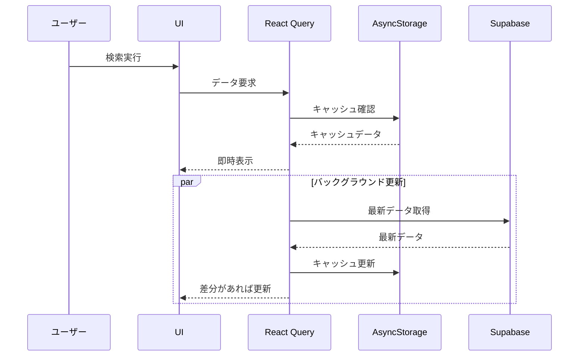
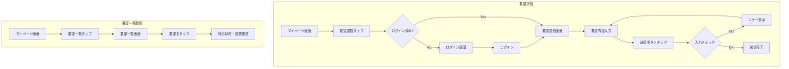
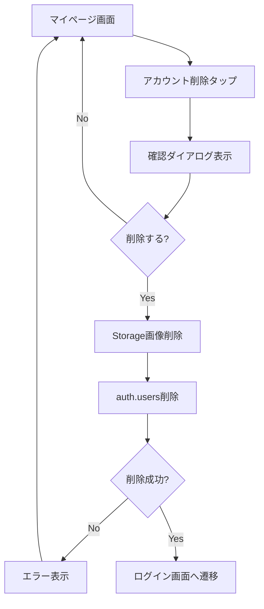
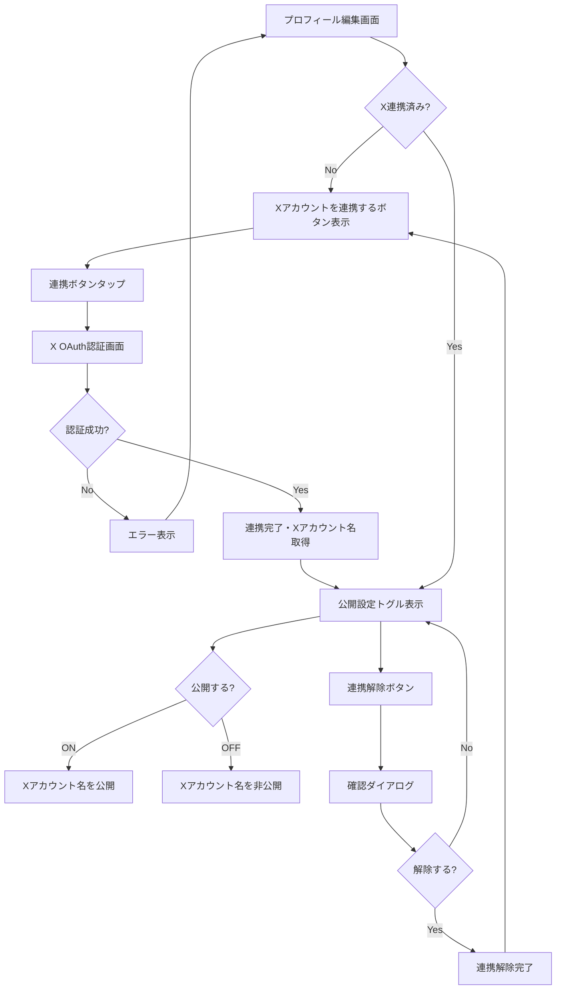

# 機能設計書

## 機能一覧

| 機能ID | 機能名 | 概要 | ログイン |
|--------|--------|------|----------|
| F001 | ユーザー認証 | メール/パスワード認証、X認証、オートログイン | - |
| F002 | 攻略情報検索 | モンスター・武器による検索、いいね数順ソート | 不要 |
| F003 | 攻略情報詳細表示 | パーティ構成、行動順序、スクリーンショット表示 | 不要 |
| F004 | 攻略情報登録 | モンスター攻略編成の登録 | 必要 |
| F005 | 攻略情報編集・削除 | 自分の攻略情報の編集・削除 | 必要 |
| F006 | いいね機能 | 攻略情報へのいいね付与・取り消し | 必要 |
| F007 | お気に入り機能 | 検索条件・攻略情報のお気に入り登録・一覧表示 | 必要 |
| F008 | 通報機能 | 不正・不適切な攻略情報の通報 | 必要 |
| F009 | ランキング表示 | いいね数ランキング、登録者ランキング | 不要 |
| F010 | プロフィール管理 | ニックネーム、アイコンの表示・編集、ログアウト | 必要 |
| F011 | 要望受付機能 | マスタデータの追加・修正要望の送信、要望一覧閲覧 | 送信:必要 / 閲覧:不要 |
| F012 | アカウント削除 | アカウントと関連データの完全削除 | 必要 |
| F013 | Xアカウント連携 | X OAuth連携、Xアカウント公開設定（オプトイン）、連携解除 | 必要 |

### 非機能要件

| 要件ID | 要件名 | 基準値 | 備考 |
|--------|--------|--------|------|
| NFR001 | アプリ起動時間 | 3秒以内 | パフォーマンス |
| NFR002 | 検索結果表示 | 2秒以内 | パフォーマンス |
| NFR003 | 同時アクティブユーザー | 1,000人 | スケーラビリティ |
| NFR004 | データ暗号化 | HTTPS/TLS、bcrypt | セキュリティ |
| NFR005 | データバックアップ | 日次自動バックアップ | 運営・保守 |
| NFR006 | サポート体制 | ベストエフォート | 運営・保守 |

---

## ユーザー認証機能【F001】

ユーザーの新規登録とログイン認証を管理する機能。

### 機能概要
- メールアドレスとパスワードによるユーザー登録・ログイン
- X（旧Twitter）によるOAuth認証
- 前回ログイン情報の記憶によるオートログイン
- ログイン不要で攻略情報の閲覧が可能
- 未ログイン状態でログイン必須機能を実行 → ログイン画面に遷移

### 初回起動時の画面遷移
```
スプラッシュ画面 → ホーム画面（未ログイン状態）
                        ↓
              ログイン必須機能を実行
                        ↓
                ログイン画面へ遷移
```

### 登録フロー（メールアドレス/パスワード）
1. ログイン画面で「新規登録」をタップ
2. メールアドレス入力
3. パスワード入力（6文字以上）
4. パスワード確認入力
5. 「利用規約とプライバシーポリシーに同意する」チェックボックスをON
   - 利用規約・プライバシーポリシーはリンクをタップで全文表示
   - チェックがOFFの場合、登録ボタンは非活性
6. 「登録」ボタンをタップ
7. 確認メールが送信される
8. メール内のリンクをクリックして認証完了
9. アプリに戻ってログイン

### 登録フロー（X認証）
1. ログイン画面で「Xでログイン」をタップ
2. 「利用規約とプライバシーポリシーに同意する」チェックボックスをON
   - 利用規約・プライバシーポリシーはリンクをタップで全文表示
   - チェックがOFFの場合、Xでログインボタンは非活性
3. Xの認証画面に遷移
4. アプリへのアクセスを許可
5. アプリに戻ってログイン完了

### ログインフロー
1. ログイン画面表示
2. メールアドレス/パスワード入力、または「Xでログイン」
3. 「ログイン」ボタンをタップ
4. ホーム画面へ遷移

### 制約事項
- パスワードは6文字以上必須
- メールアドレスは有効な形式である必要がある
- 同じメールアドレスで重複登録不可
- 利用規約・プライバシーポリシーへの同意必須（サインアップ時のみ）

### エラーケース
- メールアドレス形式が不正: 「有効なメールアドレスを入力してください」
- パスワードが短い: 「パスワードは6文字以上で入力してください」
- メールアドレスが既に登録済み: 「このメールアドレスは既に登録されています」
- ログイン失敗: 「メールアドレスまたはパスワードが正しくありません」
- ネットワークエラー: 「通信エラーが発生しました。しばらくしてから再度お試しください」

---

## 攻略情報検索機能【F002】

モンスターや武器をキーに攻略情報を検索する機能。

### 機能概要
- 「攻略対象モンスター」「武器」で検索
- 検索結果をいいね数順にソート表示
- 検索条件のお気に入り登録が可能

### 利用シーン
- 特定のモンスターの攻略方法を知りたい
- 自分が持っている武器で倒せるモンスターを探したい

### 検索フロー
1. ホーム画面（検索画面）を表示
2. モンスターを選択（任意）
3. 武器を選択（任意）
4. 「検索」ボタンをタップ
5. 検索結果一覧画面に遷移
6. いいね数順でソート表示

### キャッシュ動作（SWRパターン）
高速な検索体験を実現するため、Stale-While-Revalidate（SWR）パターンを採用。

1. **キャッシュヒット時**: キャッシュデータで即時表示
2. **バックグラウンド更新**: 並列でSupabaseから最新データを取得
3. **差分更新**: 新しいデータがあればUIを自動更新



### 検索条件
| 項目 | 入力方式 | 必須 |
|------|----------|------|
| モンスター | プルダウン選択 | 任意 |
| 武器 | プルダウン選択 | 任意 |

### 検索結果一覧表示項目
- モンスター名
- 攻略タイプ（ワンパン/セミオート/オート）
- いいね数
- 登録者ニックネーム

### 制約事項
- 検索条件が未入力の場合、全件表示（いいね数順）
- 一度に表示する件数: 20件（ページネーション）

### 操作フロー図


---

## 攻略情報詳細表示機能【F003】

攻略情報の詳細を表示する機能。

### 機能概要
- パーティ構成（4人分）の表示
- 各メンバーの武器・職業・装備スクリーンショット表示
- 行動順序・内容の表示
- 攻略タイプの表示
- いいね・お気に入り・通報ボタン

### 表示項目

| 項目 | 説明 |
|------|------|
| 攻略対象モンスター | モンスター名 |
| 攻略タイプ | ワンパン/セミオート/オート |
| パーティ構成（4人分） | 武器、職業、役割、装備スクリーンショット（2枚/人） |
| 行動順序・内容 | フリーテキスト |
| いいね数 | 現在のいいね数 |
| 登録者情報 | ニックネーム、アイコン（タップでプロフィール画面へ） |

### 操作ボタン
| ボタン | 機能 | ログイン |
|--------|------|----------|
| いいね | いいね付与/取り消し | 必要 |
| お気に入り | お気に入り登録/解除 | 必要 |
| 通報 | 通報画面へ遷移 | 必要 |

---

## 攻略情報登録機能【F004】

モンスターの攻略編成を登録する機能。

### 機能概要
- 攻略対象モンスターの選択
- パーティ4人分の構成入力
- 行動順序・内容の入力
- 攻略タイプの選択
- スクリーンショットのアップロード

### 利用シーン
- 自分が発見した攻略編成を共有したい
- コミュニティに貢献したい

### 登録フロー
1. 登録タブをタップ
2. モンスターを選択
3. パーティメンバー1人目を入力
   - 武器を選択
   - 職業を選択
   - 役割を選択（火力/回復/壁/バフ/任意）
   - スクリーンショット（表）をアップロード
   - スクリーンショット（裏）をアップロード
4. パーティメンバー2〜4人目を同様に入力
5. 行動順序・内容を入力
6. 攻略タイプを選択（ワンパン/セミオート/オート）
7. 「登録」ボタンをタップ
8. NGワードチェック
9. 登録完了

### 入力項目

| 項目 | 入力方式 | 必須 | NGワードチェック |
|------|----------|------|------------------|
| モンスター | プルダウン選択 | 必須 | - |
| 武器（×4人） | プルダウン選択 | 必須 | - |
| 職業（×4人） | プルダウン選択 | 必須 | - |
| 役割（×4人） | プルダウン選択 | 必須 | - |
| スクリーンショット（×8枚） | 画像アップロード | 必須 | - |
| 行動順序・内容 | テキスト入力 | 必須 | あり |
| 攻略タイプ | ラジオボタン選択 | 必須 | - |

### 制約事項
- ログイン必須
- スクリーンショットは5MB/枚まで
- NGワードを含む場合は登録拒否

### エラーケース
- 未ログイン: ログイン画面へ遷移
- 必須項目未入力: 「○○を入力してください」
- 画像サイズ超過: 「画像サイズは5MB以下にしてください」
- NGワード検出: 「不適切な文言が含まれています」
- ネットワークエラー: 「登録に失敗しました。再度お試しください」

### 操作フロー図


---

## 攻略情報編集・削除機能【F005】

自分が登録した攻略情報を編集・削除する機能。

### 機能概要
- マイページから自分の攻略情報一覧を表示
- 攻略情報の編集
- 攻略情報の削除

### 編集フロー
1. マイページ画面で「自分の攻略情報」をタップ
2. 自分の攻略情報一覧画面に遷移
3. 編集したい攻略情報の「編集」ボタンをタップ
4. 攻略情報編集画面に遷移
5. 内容を修正
6. 「更新」ボタンをタップ
7. 更新完了

### 削除フロー
1. 自分の攻略情報一覧画面で「削除」ボタンをタップ
2. 確認ダイアログ表示「この攻略情報を削除しますか？」
3. 「削除」を選択
4. 削除完了

### 制約事項
- 自分が登録した攻略情報のみ編集・削除可能
- 削除後の復元は不可

### 操作フロー図


---

## いいね機能【F006】

攻略情報に「いいね」を付与する機能。

### 機能概要
- 攻略情報に対していいねを付与
- いいねの取り消しが可能
- 同一ユーザーが同一攻略情報に複数回いいね不可

### いいねフロー
1. 攻略情報詳細画面で「いいね」ボタンをタップ
2. いいね数が+1される
3. ボタンが「いいね済み」状態に変化

### いいね取り消しフロー
1. 「いいね済み」ボタンをタップ
2. いいね数が-1される
3. ボタンが通常状態に戻る

### 制約事項
- ログイン必須
- 自分の攻略情報にもいいね可能

### 操作フロー図


---

## お気に入り機能【F007】

検索条件・攻略情報をお気に入り登録する機能。

### 機能概要
- 検索条件のお気に入り登録
- 攻略情報のお気に入り登録
- お気に入り一覧画面でタブ切り替え表示
- お気に入りの順序変更・削除

### お気に入り一覧画面
| タブ | 内容 |
|------|------|
| 検索条件 | 保存した検索条件一覧 |
| 攻略情報 | 保存した攻略情報一覧 |

### 制約事項
- ログイン必須

### 操作フロー図


---

## 通報機能【F008】

不正・不適切な攻略情報を通報する機能。

### 機能概要
- 攻略情報詳細画面から通報
- 同一ユーザーが同一攻略情報に複数回通報不可
- 通報後の取り消し不可
- 管理者が別途管理アプリで対応

### 通報フロー
1. 攻略情報詳細画面で「通報」ボタンをタップ
2. 確認ダイアログ表示「この攻略情報を通報しますか？」
3. 「通報する」を選択
4. 通報完了
5. 「通報しました」トースト通知

### 制約事項
- ログイン必須
- 同一攻略情報に対して1ユーザー1回のみ
- 通報の取り消し不可
- 自分の攻略情報は通報不可

### エラーケース
- 既に通報済み: 「既に通報済みです」
- 自分の攻略情報: 通報ボタン非表示

### 操作フロー図


---

## ランキング表示機能【F009】

攻略情報のいいね数ランキング、登録者ランキングを表示する機能。

### 機能概要
- 攻略情報いいね数ランキング
- 登録者別の攻略情報登録件数ランキング（週間/累計）

### ランキング種類

| ランキング | 内容 |
|-----------|------|
| 攻略情報いいね数 | いいね数が多い攻略情報順 |
| 登録者（週間） | 今週の攻略情報登録件数順 |
| 登録者（累計） | 累計の攻略情報登録件数順 |

### 表示項目（攻略情報ランキング）
- 順位
- モンスター名
- 攻略タイプ
- いいね数
- 登録者ニックネーム

### 表示項目（登録者ランキング）
- 順位
- ニックネーム
- アイコン
- 登録件数

---

## プロフィール管理機能【F010】

ユーザーのプロフィールを管理する機能。

### 機能概要
- プロフィール表示
- プロフィール編集（ニックネーム、アイコン）
- ログアウト

### 編集可能項目

| 項目 | 入力方式 | NGワードチェック |
|------|----------|------------------|
| ニックネーム | テキスト入力 | あり |
| アイコン画像 | 画像アップロード | - |

### 編集フロー
1. マイページ画面で「プロフィール編集」をタップ
2. プロフィール編集画面に遷移
3. 各項目を編集
4. 「保存」ボタンをタップ
5. NGワードチェック
6. 保存完了

### ログアウトフロー
1. マイページ画面で「ログアウト」をタップ
2. 確認ダイアログ表示「ログアウトしますか？」
3. 「ログアウト」を選択
4. ログアウト完了
5. ホーム画面（未ログイン状態）へ遷移

### 制約事項
- ログイン必須
- ニックネームはNGワードチェック対象

### 操作フロー図


---

## 要望受付機能【F011】

マスタデータの追加・修正要望を送信し、要望一覧を閲覧する機能。

### 機能概要
- マスタデータ（モンスター、武器等）の追加・修正要望を送信
- 全利用者からの要望一覧を閲覧
- 各要望の対応状況を確認
- 運営者からの回答コメントを確認

### 利用シーン
- 新しく登場したモンスターや武器がマスタデータにない場合
- マスタデータの誤りを見つけた場合
- 他の利用者の要望と対応状況を確認したい場合

### 要望送信フロー
1. マイページ画面で「要望送信」をタップ
2. 要望送信画面に遷移
3. 要望内容を入力
4. 「送信」ボタンをタップ
5. 送信完了

### 要望一覧閲覧フロー
1. マイページ画面で「要望一覧」をタップ
2. 要望一覧画面に遷移
3. 全利用者の要望を一覧表示
4. 各要望の対応状況・回答コメントを確認

### 入力項目（要望送信）

| 項目 | 入力方式 | 必須 | 備考 |
|------|----------|------|------|
| カテゴリー | プルダウン選択 | 必須 | 下記カテゴリー一覧から選択 |
| 要望内容 | テキスト入力 | 必須 | 最大500文字 |

### カテゴリー一覧

| カテゴリーID | カテゴリー名 | 説明 |
|-------------|-------------|------|
| monster | モンスターマスタ | モンスターの追加・修正要望 |
| weapon | 武器マスタ | 武器の追加・修正要望 |
| job | 職業マスタ | 職業の追加・修正要望 |
| bug | 不具合報告 | アプリの不具合報告 |
| feature | 機能要望 | 新機能や改善の要望 |
| question | 質問 | 使い方などの質問 |
| other | その他 | 上記に該当しない要望 |

### 表示項目（要望一覧）

| 項目 | 説明 |
|------|------|
| カテゴリー | 要望のカテゴリー |
| 要望内容 | 送信された要望の内容 |
| 送信日時 | 要望が送信された日時 |
| 対応状況 | 未対応/対応中/対応完了/対応不可 |
| 回答コメント | 運営者からの回答（対応完了/対応不可時） |
| 送信者ニックネーム | 要望を送信したユーザー |

### 対応状況

| ステータス | 説明 |
|-----------|------|
| 未対応 | 運営者が未確認の状態 |
| 対応中 | 運営者が確認し対応を進めている状態 |
| 対応完了 | 要望への対応が完了した状態 |
| 対応不可 | 要望への対応が不可能な状態（理由を回答コメントに記載） |

### 制約事項
- 要望送信はログイン必須
- 要望一覧閲覧はログイン不要
- 送信後の要望の編集・削除は不可
- 対応状況・回答コメントは運営者のみ更新可能

### エラーケース
- 未ログイン（送信時）: ログイン画面へ遷移
- 要望内容未入力: 「要望内容を入力してください」
- 文字数超過: 「要望内容は500文字以内で入力してください」
- ネットワークエラー: 「送信に失敗しました。再度お試しください」

### 操作フロー図


---

## アカウント削除機能【F012】

アカウントと関連する全てのデータを削除する機能。

### 機能概要
- ユーザーが自身のアカウントを完全に削除できる
- 削除時に関連する全てのデータ（攻略情報、いいね、お気に入り、通報、要望等）も削除
- 削除後は復元不可
- App Store / Google Playのガイドライン準拠
- **Supabase Edge Function経由で実行**（Admin APIはサーバーサイドのみ使用可能なため）

### 利用シーン
- アプリの利用を終了したい場合
- 個人データの完全削除を希望する場合

### 削除フロー
1. マイページ画面で「アカウント削除」をタップ
2. 確認ダイアログ表示
3. 「削除する」を選択
4. アカウント削除実行
5. ログイン画面（またはホーム画面）へ遷移

### 削除されるデータ

| データ | テーブル | 削除方法 |
|--------|----------|----------|
| ユーザー認証情報 | auth.users | Edge Function経由でAdmin API |
| プロフィール | profiles | CASCADE削除 |
| 攻略情報 | mw_strategies | CASCADE削除 |
| パーティメンバー | mw_strategy_members | CASCADE削除 |
| いいね | mw_likes | CASCADE削除 |
| 攻略お気に入り | mw_favorites_strategies | CASCADE削除 |
| 検索お気に入り | mw_favorites_searches | CASCADE削除 |
| 通報 | mw_reports | CASCADE削除 |
| 要望 | mw_requests | CASCADE削除 |
| アイコン画像 | avatarsバケット | Edge Function内でStorage API |
| スクリーンショット | mw_screenshotsバケット | Edge Function内でStorage API |

### 技術的な実装方式

アカウント削除（`auth.admin.deleteUser()`）はAdmin API（service_role key必須）であり、クライアントから直接呼び出せない。そのため、Supabase Edge Functionを経由して実行する。

```
クライアント
    ↓ supabase.functions.invoke('delete-account')
Edge Function (delete-account)
    ↓ JWT認証で本人確認
    ↓ Storage画像削除（avatars, mw_screenshots）
    ↓ supabaseAdmin.auth.admin.deleteUser(userId)
auth.users削除
    ↓ ON DELETE CASCADE
関連テーブル自動削除
```

**補足: 他の認証操作との比較**

| 操作 | API | クライアント直接呼び出し |
|------|-----|------------------------|
| アカウント作成 | `supabase.auth.signUp()` | 可能 |
| ログイン | `supabase.auth.signInWithPassword()` | 可能 |
| ログアウト | `supabase.auth.signOut()` | 可能 |
| **アカウント削除** | `supabase.auth.admin.deleteUser()` | **不可（Edge Function必要）** |

### 制約事項
- ログイン必須
- 削除後の復元は不可
- 削除されたユーザーの攻略情報も全て削除される

### エラーケース
- 未ログイン: ログイン画面へ遷移
- 削除失敗: 「削除に失敗しました。再度お試しください」
- ネットワークエラー: 「通信エラーが発生しました。しばらくしてから再度お試しください」

### 操作フロー図


---

## Xアカウント連携機能【F013】

X（旧Twitter）アカウントと連携し、Xアカウント名を公開する機能。

### 機能概要
- X OAuth認証によるアカウント連携
- 連携済みの場合のみXアカウント名の公開が可能
- 公開設定はオプトイン方式（トグルスイッチで選択）
- 連携解除機能

### 利用シーン
- 自分のXアカウントを他のユーザーに公開したい
- 攻略情報の登録者として信頼性を高めたい

### 連携フロー
1. マイページ画面で「Xアカウント連携」をタップ
2. プロフィール編集画面内のXアカウント連携セクションに遷移
3. 「Xアカウントを連携する」ボタンをタップ
4. Xの認証画面に遷移（OAuth）
5. アプリへのアクセスを許可
6. アプリに戻り、連携完了
7. Xアカウント名（@username）が自動取得・表示される

### 公開設定フロー
1. X連携済みの状態でプロフィール編集画面を表示
2. 「Xアカウントを公開する」トグルスイッチを表示
3. トグルをONにすると、Xアカウント名が他のユーザーに公開される
4. トグルをOFFにすると、Xアカウント名は非公開になる

### 連携解除フロー
1. プロフィール編集画面で「連携解除」をタップ
2. 確認ダイアログ表示「Xアカウントの連携を解除しますか？」
3. 「解除する」を選択
4. 連携解除完了（Xアカウント名・公開設定もリセット）

### 制約事項
- ログイン必須
- Xアカウント名はユーザー入力不可（OAuth連携時に自動取得）
- X連携していない場合は公開設定オプション自体が非表示
- 連携解除時はXアカウント名・公開設定がリセットされる

### エラーケース
- X認証失敗: 「Xアカウントとの連携に失敗しました。再度お試しください」
- ネットワークエラー: 「通信エラーが発生しました。しばらくしてから再度お試しください」

### 操作フロー図


### 技術的な実装方式

**Xアカウント名の保存場所**
- Xアカウント名は`profiles`テーブルには保存しない（セキュリティ上の理由）
- `auth.users.raw_user_meta_data`に自動保存される（Supabase Auth標準）

**Xアカウント名の表示方法**
- Edge Function `get-x-account` 経由で取得
- `profiles.x_account_public = true` のユーザーのみ対象
- Edge Functionが`auth.users.raw_user_meta_data.user_name`を取得して返却

**公開設定の管理**
- `profiles.x_account_public`（boolean）で公開/非公開を管理
- デフォルト: false（非公開）
- X連携解除時: x_account_public を false にリセット

**なぜprofilesにXアカウント名を保存しないのか**
- profilesテーブルはanon keyでアクセス可能（RLSで全員SELECT許可）
- Xアカウント名を保存すると、公開設定に関係なくスクレイピングリスクがある
- auth.usersはanon keyではアクセス不可のため、Edge Function経由でのみ取得可能

---

## 用語集

| 用語 | 説明 |
|------|------|
| 攻略情報 | モンスターを倒すためのパーティ編成・行動順序の情報 |
| パーティ構成 | 4人分のキャラクター編成（武器・職業・役割） |
| 攻略タイプ | ワンパン（1ターン撃破）/セミオート/オートの区分 |
| いいね | 役立った攻略情報への評価 |
| お気に入り | 後で見返すために保存する機能 |
| 通報 | 不正・不適切な攻略情報を運営に報告する行為 |
| NGワード | 不適切な文言として登録拒否される単語 |
| マスタデータ | モンスター・武器・職業などの選択肢データ |
| 要望 | マスタデータの追加・修正に関する利用者からのリクエスト |
